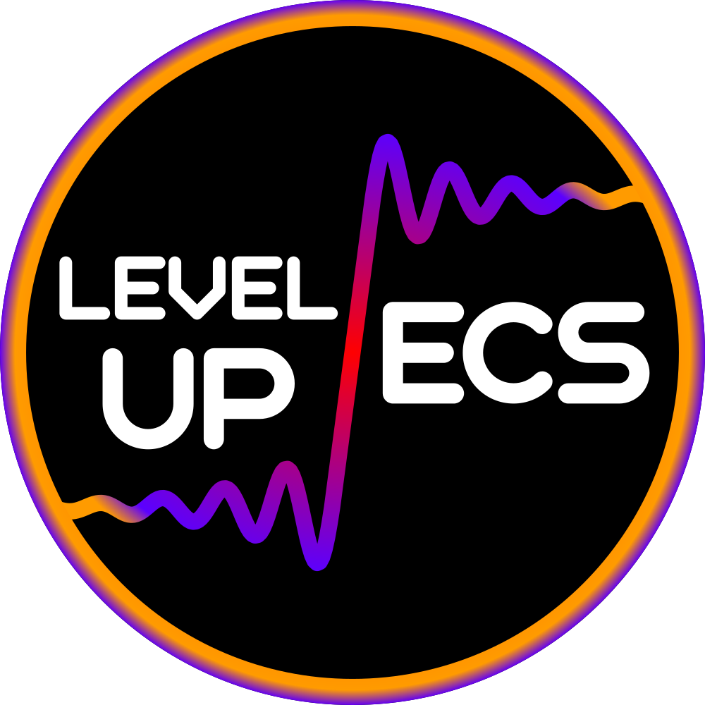
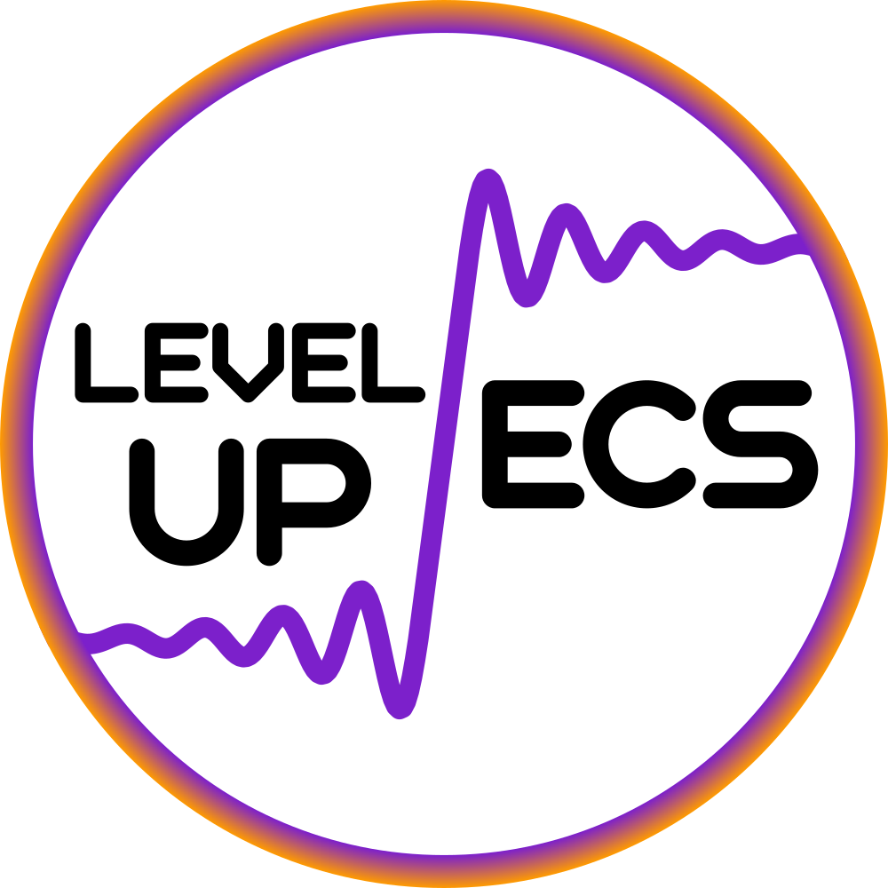

    
    

# Level-Up-ECS

Level Up ECS is a project started during the 2022-23 academic year at the University of Southampton; the project aimed to create an identity for the ECS course representatives through a logo.
The logo may be used to sign documents, e-mails, and other relevant correspondence.

## Fonts

The logo uses the "Geometry Soft Pro Font" to spell the motto "Level Up ECS."
More information about the font can be found in the `fonts` directory.

## Exports

1000 x 1000px PNG versions of the logos can be found under the `exports` directory.